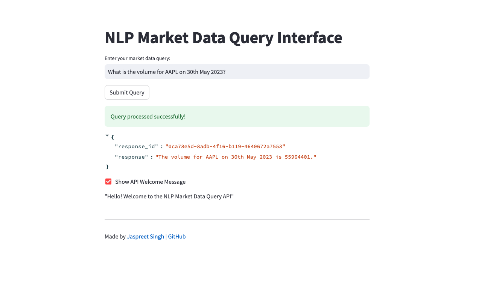

# Market Data Query API

## Introduction

The Market Data Query API is an innovative web application leveraging FastAPI and Streamlit to provide a powerful NLP Market Data Query Interface. Incorporating Langchain agents for advanced language processing, the project is containerized with Docker, ensuring ease of deployment and environment consistency.



## Features

- **FastAPI Backend**: High-performance, easy-to-use framework for APIs.
- **Streamlit Frontend**: Interactive interface for market data queries.
- **Langchain Agents**: Advanced NLP for insightful query processing.
- **Docker Integration**: Simplified deployment and consistent environments.

## Getting Started

### Prerequisites

- Docker
- Docker Compose

### Installation and Run

1. **Clone the repository**
   ```bash
   git clone https://github.com/waraichinc/financial_bot.git
   cd financial_bot
   ```
2. **Copy the .env.sample into .env and set the appropriate env variables**
   ```bash
   API_KEY=API_KEY
   DATA_FILE_PATH=FILE_PATH
   HOST=HOSTNAME
   PORT=PORT
   ```
3. **Build and Run with Docker Compose**
   ```bash
   docker-compose up --build
   ```
4. **Access the application**
   - FastAPI backend: http://localhost:8000
   - Streamlit frontend: http://localhost:8501

### Development Guide

1. **Setting Up the Development Environment**
   - Install Docker and Docker Compose.
   - Clone the repository and build the services:
   ```bash
   docker-compose build
   ```
2. **Making Changes**
   - Apply changes to the FastAPI backend or Streamlit Frontend.
   - Rebuild and restart the services:
   ```bash
   docker-compose up --build
   ```
3. **Running Tests**
   - Install tox
   ```bash
   pip install tox
   ```
   - Execute tests with tox:
   ```bash
   tox
   ```

## Technologies Used

- **FastAPI**
- **Streamlit**
- **Langchain Agents**
- **Docker**

## Contributing

Contributions are welcome! For more details, please read the CONTRIBUTING.md.

## License

This project is licensed under the MIT License - see the LICENSE file for details.

## Acknowledgments

A big thank you to all contributors and supporters of this project.

Special thanks to Jaspreet Singh. Connect with him on [LinkedIn](https://www.linkedin.com/in/waraichinc/).
